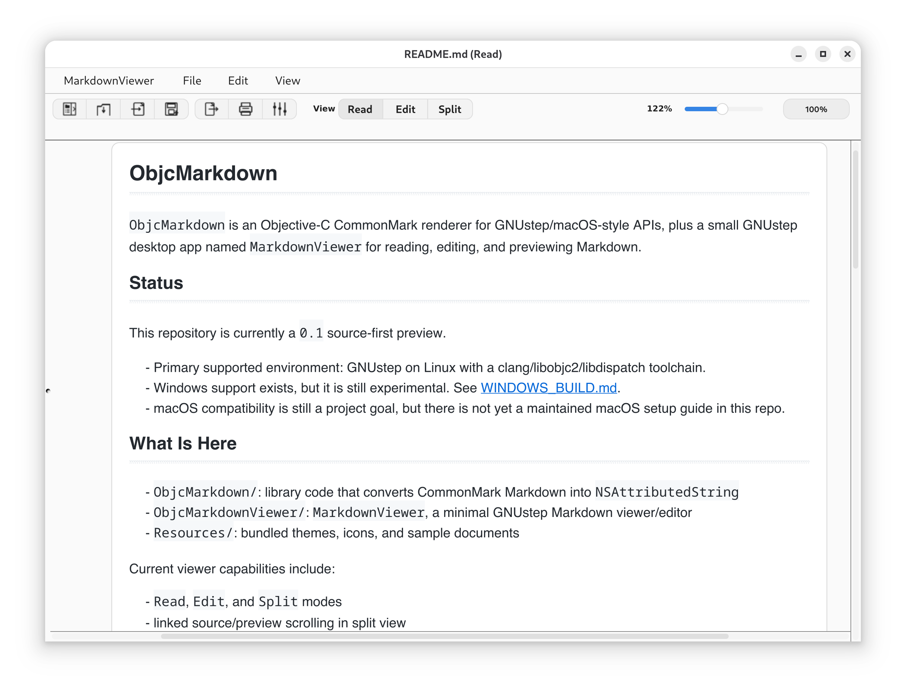
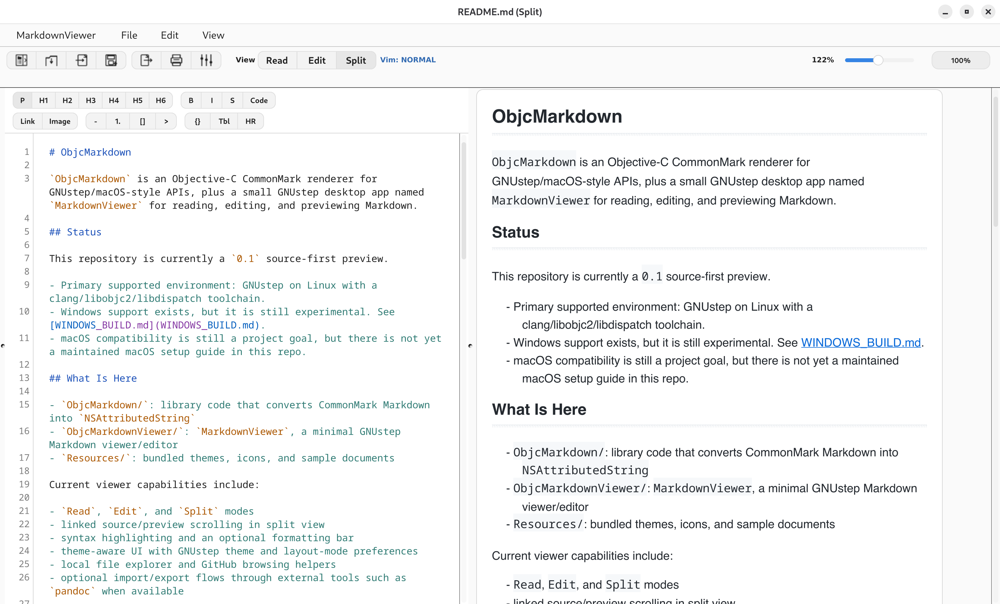
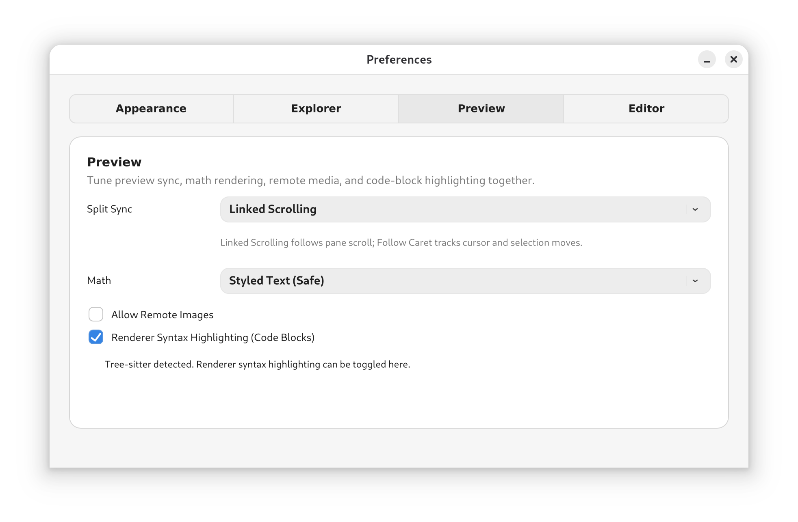
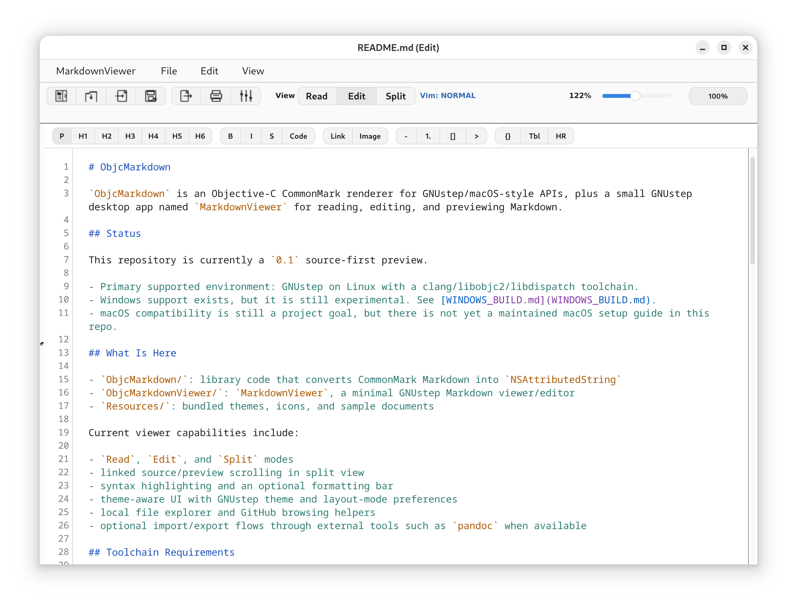

# ObjcMarkdown

`ObjcMarkdown` includes `MarkdownViewer`, a GNUstep desktop Markdown app for reading, editing, previewing, importing, and exporting documents. The repository also includes the reusable Objective-C CommonMark renderer that powers the app for projects that want Markdown rendered to `NSAttributedString`.

## MarkdownViewer Highlights

`MarkdownViewer` is the main end-user app in this repo. Current capabilities include:

- `Read`, `Edit`, and `Split` modes
- linked source/preview scrolling in split view
- a syntax-highlighted source editor with line numbers, an optional formatting bar, and optional Vim key bindings
- rendered preview with GitHub-style tables, math styling, and copy buttons for code blocks
- theme, layout, source-editor, and explorer preferences
- local file explorer and GitHub repository browsing

## Import And Export

`MarkdownViewer` is not limited to `.md` files. It opens Markdown directly, can print or export the rendered document as PDF, and, when `pandoc` is installed, can turn Word and other rich-text documents into editable Markdown.

Native/document-first behavior:

- open and edit Markdown files directly
- print or export the rendered document to PDF from the viewer

Pandoc-backed conversions, when `pandoc` is installed:

- import: `DOCX`, `RTF`, `ODT`, `HTML`, `HTM`
- export: `DOCX`, `RTF`, `ODT`, `HTML`, `HTM`

If `pandoc` is unavailable, those non-Markdown import/export formats are disabled, but native Markdown editing plus print/PDF export remain available.

## Screenshots

A few views from the current app:

### Read mode



### Split mode



### Preferences



### Edit mode



## Use The Library In Your App

`MarkdownViewer` is built on the same renderer library shipped in `ObjcMarkdown/`, so app developers can embed that rendering path directly.

If you just want Markdown rendered into an `NSTextView`, the small path is one renderer object and one method call:

```objc
#import "OMMarkdownRenderer.h"

OMMarkdownRenderer *renderer = [[[OMMarkdownRenderer alloc] init] autorelease];
NSAttributedString *rendered = [renderer attributedStringFromMarkdown:
    @"# Hello\n\nThis is **Markdown** rendered into an `NSAttributedString`."];

[[textView textStorage] setAttributedString:rendered];
```

`-init` uses the default GitHub-like theme and default parsing options, so the common embed case stays small. If you need more control, use `OMTheme` and `OMMarkdownParsingOptions` to load a TOML theme, set a base URL for relative links, change HTML handling, tune image behavior, or adjust syntax-highlighting and math-rendering behavior.

## Renderer Capabilities

The shared renderer is centered on CommonMark, with a few pragmatic additions on top. These capabilities power `MarkdownViewer` preview and are also what you get when embedding the library directly.

Currently supported in the renderer:

- CommonMark headings, paragraphs, emphasis, strong emphasis, inline code, and fenced or indented code blocks
- blockquotes, ordered lists, unordered lists, and thematic breaks
- links, relative links with base-URL resolution, and image attachments with fallback text when decoding fails
- inline and block HTML as safe fallback text by default, with an explicit ignore policy available in code
- optional math styling for inline and display math
- optional full LaTeX-backed math artifact rendering when the required external toolchain is available
- GitHub-style pipe tables, including horizontal overflow for wide tables
- optional renderer syntax highlighting for code blocks when the required tooling is available

## Status

This repository is currently a `0.1` source-first preview.

- Primary supported environment: GNUstep on Linux with a clang/libobjc2/libdispatch toolchain.
- Windows support exists through the MSYS2 `clang64` toolchain. PowerShell/Codex sessions should use `scripts/windows/build-from-powershell.ps1`; see [WINDOWS_BUILD.md](WINDOWS_BUILD.md).
- macOS compatibility is still a project goal, but there is not yet a maintained macOS setup guide in this repo.

## Toolchain Requirements

This project is validated against a clang-based GNUstep stack with `libobjc2` and `libdispatch`.

Important: stock Debian/Ubuntu GNUstep packages are commonly built around the GCC Objective-C runtime and are not a drop-in environment for this repo. The supported path is a clang/libobjc2/libdispatch GNUstep installation, either from your own packages or from a source build using GNUstep's tooling.

If you are building GNUstep yourself on Debian-like systems, the reference path on this machine is GNUstep's clang flow from `tools-scripts`. See [docs/linux-clang-toolchain.md](docs/linux-clang-toolchain.md).

## Build On GNUstep/Linux

1. Clone the repo and submodules:

```bash
git clone https://github.com/danjboyd/ObjcMarkdown.git
cd ObjcMarkdown
git submodule update --init --recursive
```

2. Source the GNUstep environment:

```bash
source /usr/GNUstep/System/Library/Makefiles/GNUstep.sh
```

3. Build:

```bash
gmake
```

4. Run the app:

```bash
gmake run Resources/sample-commonmark.md
```

Notes:

- `cmark` headers and libraries must be available to the toolchain.
- `third_party/libs-OpenSave` and `third_party/TextViewVimKit` are required submodules.
- The GNUstep build on the authoring machine currently uses GNUstep Base `1.31.1`.

## Run Tests

The test runner is `tools-xctest`.

```bash
scripts/ci/run-linux-ci.sh
```

That script builds the repo, prepares the GNUstep defaults lock directory, and runs:

```bash
xctest ObjcMarkdownTests/ObjcMarkdownTests.bundle
```

## CI

GitHub Actions includes a Linux build/test workflow for the GNUstep clang environment used by this project. That lane intentionally targets a self-hosted runner with the required `clang`/`libobjc2`/`libdispatch` GNUstep stack instead of pretending stock distro GNUstep packages are sufficient.

The current Linux CI entry point is:

- [linux-gnustep-clang.yml](.github/workflows/linux-gnustep-clang.yml)

Linux release packaging is handled separately so the build/test lane stays small:

- [linux-appimage.yml](.github/workflows/linux-appimage.yml)

Windows packaging and release publishing are handled by:

- [windows-packaging.yml](.github/workflows/windows-packaging.yml)

Release flow:

- Ensure the target commit has already passed the separate Linux CI workflow if you want a GNUstep/Linux gate before release tagging.
- Push an annotated tag like `v0.1.0`.
- GitHub Actions runs `linux-appimage` as a thin caller to the reusable `gnustep-packager` workflow pinned to `bca864ff163e129100881145e017429fed155bf7`, using this repo's Linux manifest, stage script, and self-hosted GNUstep preflight.
- GitHub Actions runs `windows-packaging` as a thin caller to the same pinned reusable workflow, using this repo's Windows MSI manifest and normalized Windows stage script. The staged Windows payload includes the GNUstep runtime, bundled Windows themes, and TinyTeX runtime for external LaTeX rendering. Windows releases are expected to bundle `WinUITheme` and use it as the default packaged theme.
- Each tagged packaging workflow then downloads its `-packages` artifact and attaches the release files to the matching GitHub Release page. Linux publishes the `.AppImage` and `.zsync`; Windows publishes the `.msi` and portable ZIP, along with generated sidecars such as `.update-feed.json`.
- Clean-machine Windows validation is documented in [docs/windows-otvm-msi-validation.md](docs/windows-otvm-msi-validation.md). Going forward, the supported Debian and Windows VM path is libvirt-backed `OracleTestVMs` leases. The older direct-OCI helper has been retired; [docs/windows-oci-msi-validation.md](docs/windows-oci-msi-validation.md) is kept only as a retirement note.

## Public Docs

- [Roadmap.md](Roadmap.md)
- [OpenIssues.md](OpenIssues.md)
- [ClosedIssues.md](ClosedIssues.md)
- [WINDOWS_BUILD.md](WINDOWS_BUILD.md)
- [packaging/README.md](packaging/README.md)
- [docs/windows-oci-msi-validation.md](docs/windows-oci-msi-validation.md)
- [docs/linux-clang-toolchain.md](docs/linux-clang-toolchain.md)
- [docs/linux-appimage-packaging.md](docs/linux-appimage-packaging.md)
- [docs/linux-debian-vm-validation.md](docs/linux-debian-vm-validation.md)

Working notes, milestone handoffs, and validation checklists that were cluttering the repo root now live under [docs/internal](docs/internal/README.md).

## License

Licensing is split by component:

- `ObjcMarkdown/`: `LGPL-2.1-or-later`
- `ObjcMarkdownViewer/` and `ObjcMarkdownTests/`: `GPL-2.0-or-later`
- `third_party/`: upstream licenses apply

See [LICENSE](LICENSE) and [LICENSES/](LICENSES).
