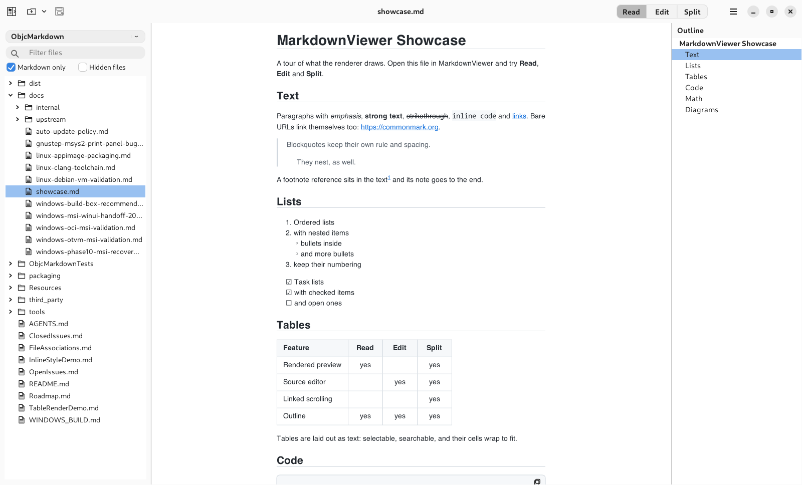
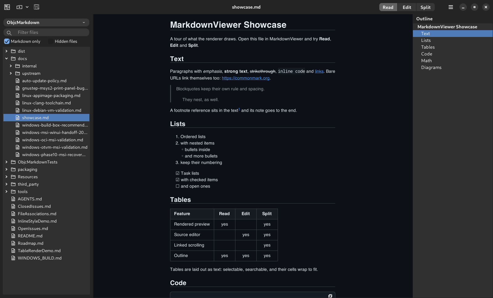
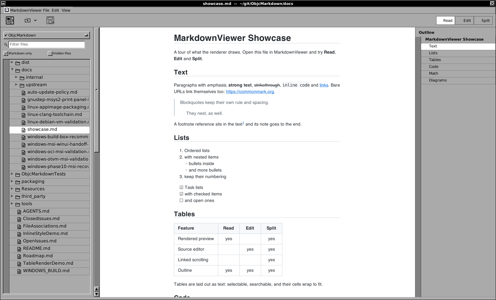
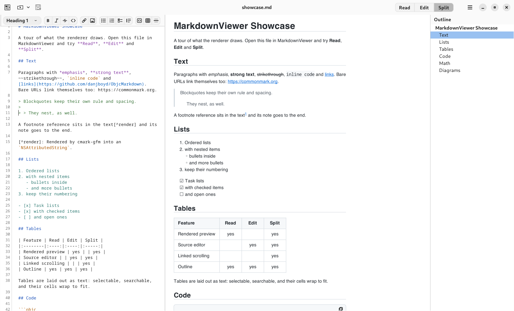
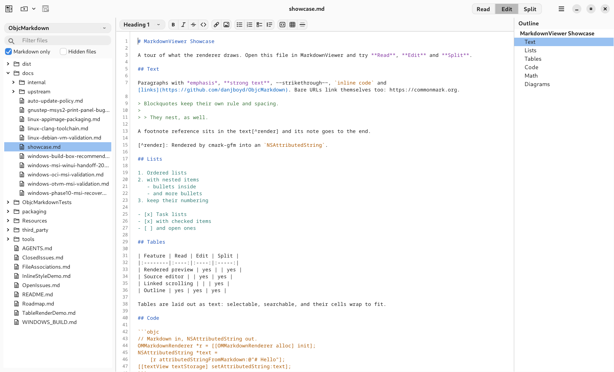
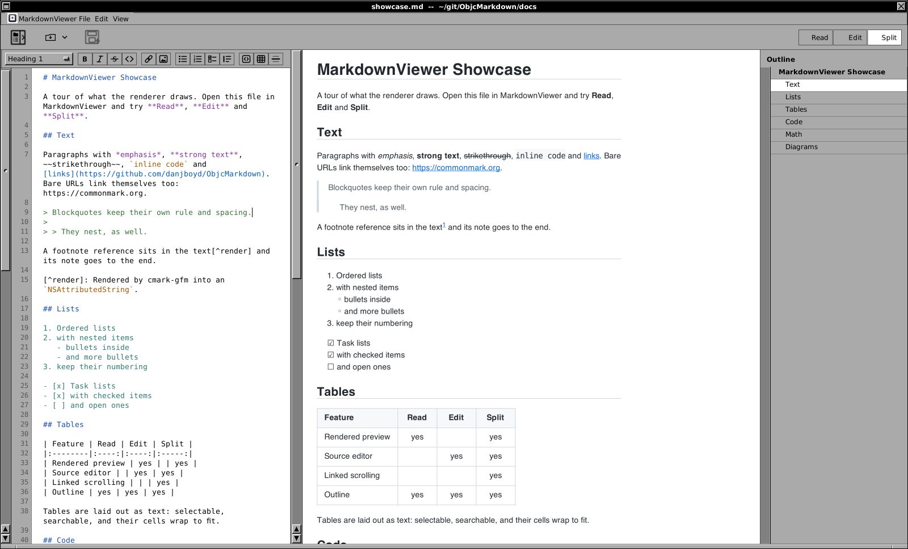
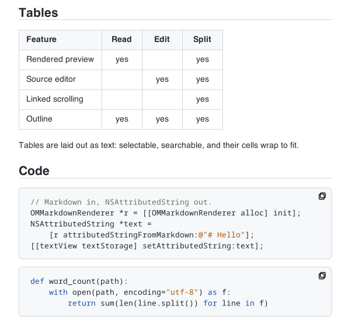
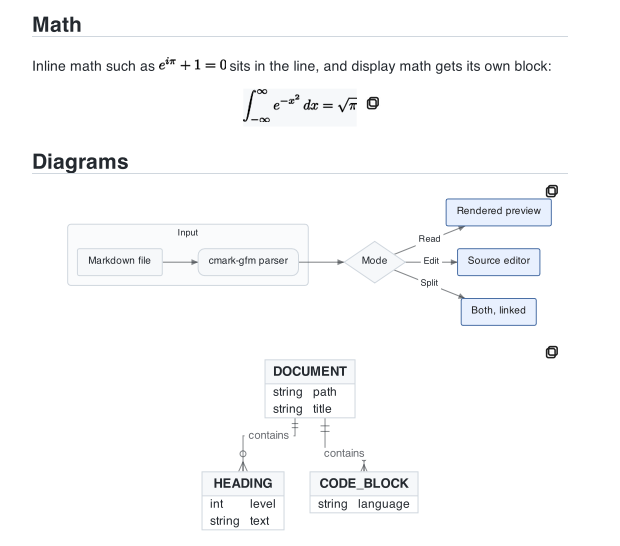

# ObjcMarkdown

**MarkdownViewer** is a desktop Markdown reader and editor built on GNUstep: rendered previews with tables, math, Mermaid diagrams and highlighted code, a source editor with linked scrolling, and a file explorer. Under the hood is **ObjcMarkdown**, the reusable Objective-C renderer that turns CommonMark and GitHub-flavored Markdown into an `NSAttributedString`, ready for any `NSTextView`.



## One App, Any Theme

MarkdownViewer uses only standard controls and system colours, and lets the GNUstep theme decide how they look. The same build looks like a GNOME app under [Adwaita](https://github.com/danjboyd/plugins-themes-Adwaita), with its header bar, GNOME's file chooser and dark mode, and like a classic GNUstep app under GNUstep's own theme. On Windows it will look like a WinUI app under WinUITheme; screenshots will follow when that theme is ready.

| Adwaita, dark | GNUstep theme |
|:---:|:---:|
|  |  |

## Read, Edit, Split

Read for the rendered document, Edit for the Markdown source, and Split for both side by side, with the preview following the editor as you scroll and type.



| Edit mode, with the formatting bar | Split mode, GNUstep theme |
|:---:|:---:|
|  |  |

## Features

- **Read, Edit and Split modes**, with linked scrolling between source and preview
- **A source editor** with syntax highlighting, line numbers, an optional formatting bar and optional Vim key bindings
- **An explorer sidebar**: the document's repository or folder as a tree, with recent folders, a filter, a Markdown-only option and a context menu (open in a new tab, reveal, copy paths)
- **An outline** of the document's headings that follows where you are
- **Tabs** for several documents in one window
- **Open Location**: Markdown files straight from GitHub or any web address, read-only
- **Import and export**: print or export to PDF, and, with `pandoc` installed, import and export `DOCX`, `RTF`, `ODT` and `HTML`
- **Copy buttons** on code blocks and diagrams
- **Preferences** for the theme, layout density, editor and explorer

## Rendering

The renderer parses with GitHub's [cmark-gfm](https://github.com/github/cmark-gfm), vendored and compiled in, so the app, the editor's highlighting and the scroll sync agree on the document's structure. Try it on [docs/showcase.md](docs/showcase.md).

| Tables and code | Math and diagrams |
|:---:|:---:|
|  |  |

- CommonMark: headings, emphasis, links, images, blockquotes, lists, code blocks, thematic breaks
- GitHub-flavored Markdown: tables, task lists, strikethrough, autolinks and footnotes
- **Tables laid out as text**: selectable and searchable, with links and cells that wrap to fit (or drawn as an image that may run wider than the view, via `allowTableHorizontalOverflow`)
- **Mermaid** `flowchart` (with subgraphs, `classDef` and `style`) and `erDiagram` blocks drawn as diagrams, with the source one click away; other Mermaid types show their source with a note
- **Math**: inline and display math as styled text, or typeset through LaTeX when a TeX toolchain is installed
- **Syntax highlighting** for code blocks in Objective-C, C and C++, Swift, Python, JavaScript and TypeScript, Go, Rust, Java, Kotlin, C#, PHP, Ruby, SQL, JSON, YAML, TOML, HTML and XML
- Relative links and images resolved against the document's location; inline and block HTML shown as safe text by default
- Themes in TOML, with a GitHub-like default

## Use The Library In Your App

`MarkdownViewer` is built on the same renderer library shipped in `ObjcMarkdown/`, so app developers can embed that rendering path directly.

If you just want Markdown rendered into an `NSTextView`, the small path is one renderer object and one method call:

```objc
#import "OMMarkdownRenderer.h"

OMMarkdownRenderer *renderer = [[[OMMarkdownRenderer alloc] init] autorelease];
NSAttributedString *rendered = [renderer attributedStringFromMarkdown:
    @"# Hello\n\nThis is **Markdown** rendered into an `NSAttributedString`."];

[[textView textStorage] setAttributedString:rendered];
```

`-init` uses the default GitHub-like theme and default parsing options, so the common embed case stays small. If you need more control, use `OMTheme` and `OMMarkdownParsingOptions` to load a TOML theme, set a base URL for relative links, change HTML handling, tune image behavior, or adjust syntax-highlighting and math-rendering behavior.

## Install

- **Windows**: the MSI or portable ZIP from [Releases](https://github.com/danjboyd/ObjcMarkdown/releases), with WinUITheme bundled as the default theme.
- **Linux**: an AppImage with the GNUstep runtime and the Adwaita theme bundled, built by [linux-appimage.yml](.github/workflows/linux-appimage.yml); the next tagged release attaches it. Until then, build from source as below.

## Status

This repository is currently a `0.1` source-first preview.

- Primary supported environment: GNUstep on Linux with a clang/libobjc2/libdispatch toolchain.
- Windows support exists through the MSYS2 `clang64` toolchain. PowerShell/Codex sessions should use `scripts/windows/build-from-powershell.ps1`; see [WINDOWS_BUILD.md](WINDOWS_BUILD.md).
- macOS compatibility is still a project goal, but there is not yet a maintained macOS setup guide in this repo.

## Toolchain Requirements

This project is validated against a clang-based GNUstep stack with `libobjc2` and `libdispatch`.

Important: stock Debian/Ubuntu GNUstep packages are commonly built around the GCC Objective-C runtime and are not a drop-in environment for this repo. The supported path is a clang/libobjc2/libdispatch GNUstep installation, either from your own packages or from a source build using GNUstep's tooling.

If you are building GNUstep yourself on Debian-like systems, the reference path on this machine is GNUstep's clang flow from `tools-scripts`. See [docs/linux-clang-toolchain.md](docs/linux-clang-toolchain.md).

## Build On GNUstep/Linux

1. Clone the repo and submodules:

```bash
git clone https://github.com/danjboyd/ObjcMarkdown.git
cd ObjcMarkdown
git submodule update --init --recursive
```

2. Source the GNUstep environment:

```bash
source /usr/GNUstep/System/Library/Makefiles/GNUstep.sh
```

3. Build:

```bash
gmake
```

4. Run the app:

```bash
gmake run Resources/sample-commonmark.md
```

Notes:

- No system `cmark` is needed: GitHub's `cmark-gfm` parser (tables, task lists, strikethrough, autolinks, footnotes) is vendored in `third_party/cmark-gfm` and compiled into `libObjcMarkdown`.
- `third_party/TextViewVimKit` is a required submodule, and `third_party/libs-OpenSave` is too on Windows, where it provides the native open and save dialogs.
- On Linux the GNUstep theme provides the open and save panels: GNOME's file chooser under the Adwaita theme (through the XDG desktop portal), GNUstep's own panels under its default theme or where no portal runs.
- The GNUstep build on the authoring machine currently uses GNUstep Base `1.31.1`.

## Run Tests

The test runner is `tools-xctest`.

```bash
scripts/ci/run-linux-ci.sh
```

That script builds the repo, prepares the GNUstep defaults lock directory, and runs:

```bash
xctest ObjcMarkdownTests/ObjcMarkdownTests.bundle
```

## CI

GitHub Actions builds and tests on Linux in the GNUstep clang environment this project uses (`clang`/`libobjc2`/`libdispatch`, not the stock distro packages), on GitHub-hosted runners inside a container image that holds that toolchain:

- [linux-gnustep-clang.yml](.github/workflows/linux-gnustep-clang.yml): build and tests, on pushes to `main`, pull requests and by hand
- [ci-image.yml](.github/workflows/ci-image.yml): builds the image from [ci/linux/Dockerfile](ci/linux/Dockerfile) (every source pinned by commit) and pushes it to `ghcr.io/danjboyd/objcmarkdown-ci`; the CI workflow is pinned to its digest

Linux release packaging is handled separately so the build/test lane stays small:

- [linux-appimage.yml](.github/workflows/linux-appimage.yml)

Windows packaging and release publishing are handled by:

- [windows-packaging.yml](.github/workflows/windows-packaging.yml)

Release flow:

- Ensure the target commit has already passed the separate Linux CI workflow if you want a GNUstep/Linux gate before release tagging.
- Push an annotated tag like `v0.1.0`.
- GitHub Actions runs `linux-appimage` as a thin caller to the reusable `gnustep-packager` workflow pinned to `4814554c9e445170217bd6849efea05b98e62856`, on a GitHub-hosted runner inside the same CI image, using this repo's Linux manifest, stage script and preflight. It bundles the Adwaita theme at the commit pinned in [packaging/inputs.json](packaging/inputs.json).
- GitHub Actions runs `windows-packaging` as a thin caller to the reusable `gnustep-packager` workflow pinned to `bac42892f79ae1c7d56017d7cdb1d1637d729e6b`, using this repo's Windows MSI manifest and normalized Windows stage script. The Windows manifest owns app-specific host dependencies (currently none: `cmark-gfm` is vendored). The staged Windows payload includes the GNUstep runtime, bundled Windows themes, and TinyTeX runtime for external LaTeX rendering. Windows releases are expected to bundle `WinUITheme` and use it as the default packaged theme.
- Each tagged packaging workflow then downloads its `-packages` artifact and attaches the release files to the matching GitHub Release page. Linux publishes the `.AppImage` and `.zsync`; Windows publishes the `.msi` and portable ZIP, along with generated sidecars such as `.update-feed.json`.
- Clean-machine Windows validation is documented in [docs/windows-otvm-msi-validation.md](docs/windows-otvm-msi-validation.md). Going forward, the supported Debian and Windows VM path is libvirt-backed `OracleTestVMs` leases. The older direct-OCI helper has been retired; [docs/windows-oci-msi-validation.md](docs/windows-oci-msi-validation.md) is kept only as a retirement note.

## Public Docs

- [Roadmap.md](Roadmap.md)
- [Issues on GitHub](https://github.com/danjboyd/ObjcMarkdown/issues) (the earlier [OpenIssues.md](OpenIssues.md) and [ClosedIssues.md](ClosedIssues.md) are an archive)
- [WINDOWS_BUILD.md](WINDOWS_BUILD.md)
- [packaging/README.md](packaging/README.md)
- [docs/windows-oci-msi-validation.md](docs/windows-oci-msi-validation.md)
- [docs/linux-clang-toolchain.md](docs/linux-clang-toolchain.md)
- [docs/linux-appimage-packaging.md](docs/linux-appimage-packaging.md)
- [docs/linux-debian-vm-validation.md](docs/linux-debian-vm-validation.md)

Working notes, milestone handoffs, and validation checklists that were cluttering the repo root now live under [docs/internal](docs/internal/README.md).

## License

Licensing is split by component:

- `ObjcMarkdown/`: `LGPL-2.1-or-later`
- `ObjcMarkdownViewer/` and `ObjcMarkdownTests/`: `GPL-2.0-or-later`
- `third_party/`: upstream licenses apply

See [LICENSE](LICENSE) and [LICENSES/](LICENSES).
