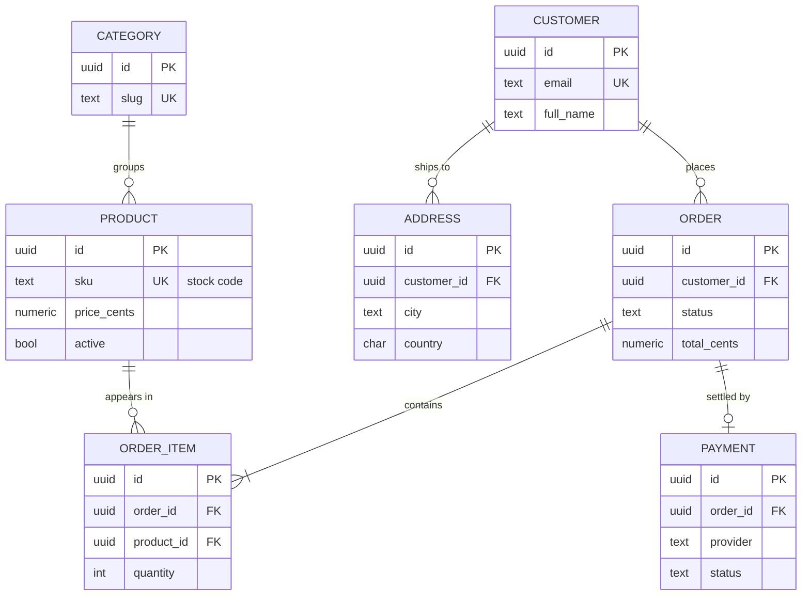
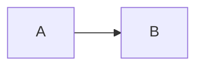

# Storefront Schema

A sample entity-relationship diagram. Mermaid `erDiagram` blocks are drawn in the
preview; switch `View -> Diagram Rendering -> Diagram Source` to read the source
instead.



## Reading The Notation

Each end of a relationship carries a marker: a bar for one, a crow's foot for
many, and a circle when the end is optional.

| Notation | Reads as | In this schema |
| --- | --- | --- |
| `\|\|--o{` | one to zero-or-many | a customer may have no orders yet |
| `\|\|--\|{` | one to one-or-many | an order always has at least one line item |
| `\|\|--o\|` | one to zero-or-one | an order is settled by at most one payment |

## Fallback Behavior

Other mermaid diagram types render as ordinary code blocks:



So does an `erDiagram` that cannot be parsed, with a diagnostic naming the line:

```mermaid
erDiagram
    A {
        lonely
    }
```
