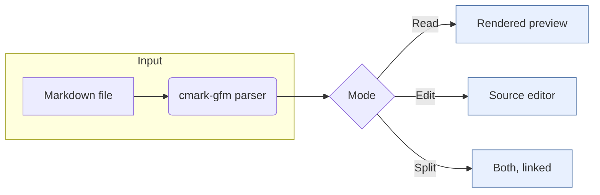
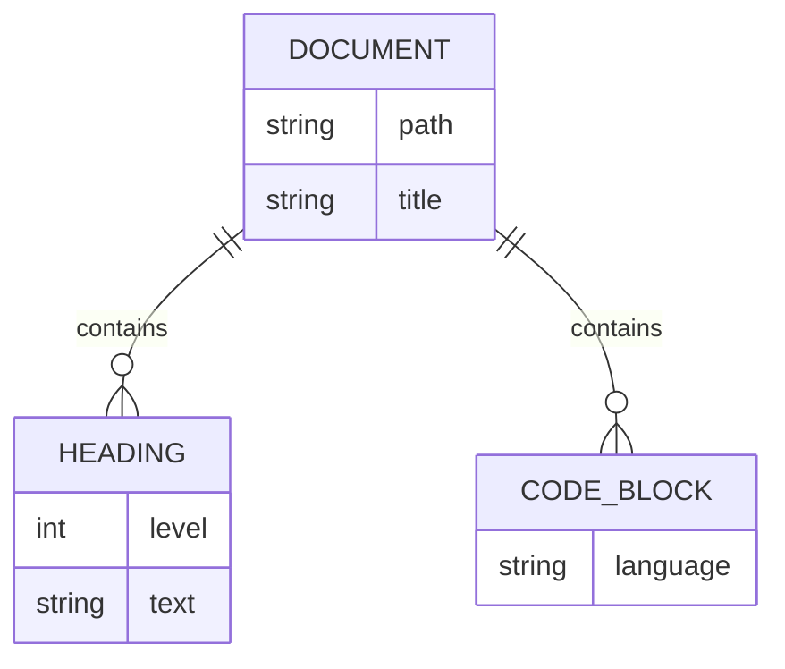

# MarkdownViewer Showcase

A tour of what the renderer draws. Open this file in MarkdownViewer and try **Read**, **Edit** and **Split**.

## Text

Paragraphs with *emphasis*, **strong text**, ~~strikethrough~~, `inline code` and [links](https://github.com/danjboyd/ObjcMarkdown). Bare URLs link themselves too: https://commonmark.org.

> Blockquotes keep their own rule and spacing.
>
> > They nest, as well.

A footnote reference sits in the text[^render] and its note goes to the end.

[^render]: Rendered by cmark-gfm into an `NSAttributedString`.

## Lists

1. Ordered lists
2. with nested items
   - bullets inside
   - and more bullets
3. keep their numbering

- [x] Task lists
- [x] with checked items
- [ ] and open ones

## Tables

| Feature | Read | Edit | Split |
|:--------|:----:|:----:|:-----:|
| Rendered preview | yes | | yes |
| Source editor | | yes | yes |
| Linked scrolling | | | yes |
| Outline | yes | yes | yes |

Tables are laid out as text: selectable, searchable, and their cells wrap to fit.

## Code

```objc
// Markdown in, NSAttributedString out.
OMMarkdownRenderer *r = [[OMMarkdownRenderer alloc] init];
NSAttributedString *text =
    [r attributedStringFromMarkdown:@"# Hello"];
[[textView textStorage] setAttributedString:text];
```

```python
def word_count(path):
    with open(path, encoding="utf-8") as f:
        return sum(len(line.split()) for line in f)
```

## Math

Inline math such as $e^{i\pi} + 1 = 0$ sits in the line, and display math gets its own block:

$$
\int_{-\infty}^{\infty} e^{-x^2}\,dx = \sqrt{\pi}
$$

## Diagrams





---

Made with GNUstep.
